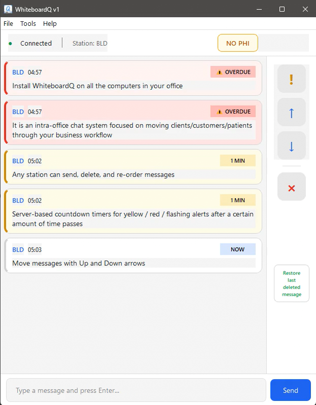
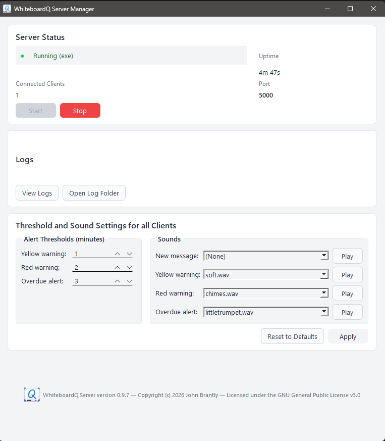

# WhiteboardQ

Real-time message queue for office communication. Install on all computers in your small business. Staff posts short messages (using initials and codes, never PHI) and the board keeps everyone in sync across workstations in different rooms. Messages age through color-coded states. Your data never leaves your network!

<p align="center">
  <a href="docs/images/whiteboardQ-demo.mp4">
    
  </a>
</p>




## Features

- Real-time WebSocket messaging across all connected workstations
- Color-coded message aging (green > yellow > red > overdue) with configurable thresholds
- Automatic LAN server discovery via UDP broadcast
- Sound alerts for message state transitions
- Drag-to-reorder message priority
- Light and dark themes
- TLS encryption (self-signed certificates auto-generated on first run)
- Two server deployment options (see below)

## Deployment Options

| Installer | Use Case | How Server Runs | Auto-Start |
|-----------|----------|-----------------|------------|
| **FrontDesk** | Small offices, front desk PC | Tray app manages server as subprocess | On user login |
| **BackOffice** | IT-managed, always-on | Windows Service | On system boot |

Both ship with a Server Manager GUI for configuration, and a separate Client installer for workstations.

## System Requirements

- Windows 10 or later
- Python 3.12+ (for building from source)
- [Inno Setup 6.x](https://jrsoftware.org/isinfo.php) (for building installers)

PySide6 (Qt for Python) is installed automatically via pip. This is a ~200MB download on first install.

## Network Ports

| Port | Protocol | Purpose |
|------|----------|---------|
| 5000 | TCP (TLS) | WebSocket + REST API |
| 5001 | UDP | LAN discovery (broadcast) |

Both ports are opened in Windows Firewall by the installers.

## Building from Source

```powershell
# Clone and set up
git clone https://github.com/johnbrantly/whiteboardq.git
cd whiteboardq
python -m venv venv
.\venv\Scripts\Activate.ps1

# Install dependencies
pip install -r requirements.txt      # Everything (server + client)
pip install -r requirements-dev.txt  # Build/test tools (pytest, pyinstaller)

# Or install only what you need:
# pip install -r requirements-server.txt   # Server + Manager only
# pip install -r requirements-client.txt   # Client only

# Build all executables
python build.py

# Build installers (requires Inno Setup 6.x)
.\build.ps1
```

Build targets: `python build.py client`, `python build.py server`, `python build.py service`, `python build.py frontdesk-manager`, `python build.py backoffice-manager`

Built installers go to `dist/installer/`.

### Build Outputs

| Executable | Purpose | Included In |
|------------|---------|-------------|
| `WhiteboardQ.exe` | Desktop client | Client installer |
| `WhiteboardQ-Server.exe` | Standalone server | FrontDesk installer |
| `WhiteboardQ-Server-Service.exe` | Server as Windows Service | BackOffice installer |
| `WhiteboardQ-FrontDesk-Manager.exe` | Tray app + server control | FrontDesk installer |
| `WhiteboardQ-BackOffice-Manager.exe` | Service control GUI | BackOffice installer |

## Running in Development

```powershell
# Terminal 1: Server Manager (starts server automatically)
python -m whiteboardq_server.manager

# Terminal 2: Client
python -m whiteboardq_client.main
```

Server data (database, logs, certs) is stored in `%ProgramData%\WhiteboardQ\` in both dev and production. This directory is created automatically but requires write access — run your terminal as administrator if you get permission errors.

## Testing

```powershell
pip install -r requirements-dev.txt
pytest
```

A CLI test tool is also included for load testing and server diagnostics:

```powershell
python -m whiteboardq_test_tool --help
```

See `whiteboardq_test_tool/README.md` for details.

## Project Structure

```
whiteboardq/
  whiteboardq_client/    # PySide6 desktop client
  whiteboardq_server/    # FastAPI + uvicorn server
    manager/             # Server Manager GUI (FrontDesk & BackOffice)
    service.py           # Windows Service wrapper
  whiteboardq_test_tool/ # CLI for load testing and server diagnostics
  installers/            # Inno Setup scripts
  build.py               # Build script
```

## Contributing

This project is not accepting pull requests. You're welcome to fork and build upon it under the terms of the GPL. Bug reports via [GitHub Issues](https://github.com/johnbrantly/whiteboardq/issues) are appreciated. See [CONTRIBUTING.md](CONTRIBUTING.md) for details.

## License

Copyright (c) 2026 John Brantly

This program is free software: you can redistribute it and/or modify it under the terms of the GNU General Public License as published by the Free Software Foundation, version 3.

See [LICENSE](LICENSE) for the full text.
